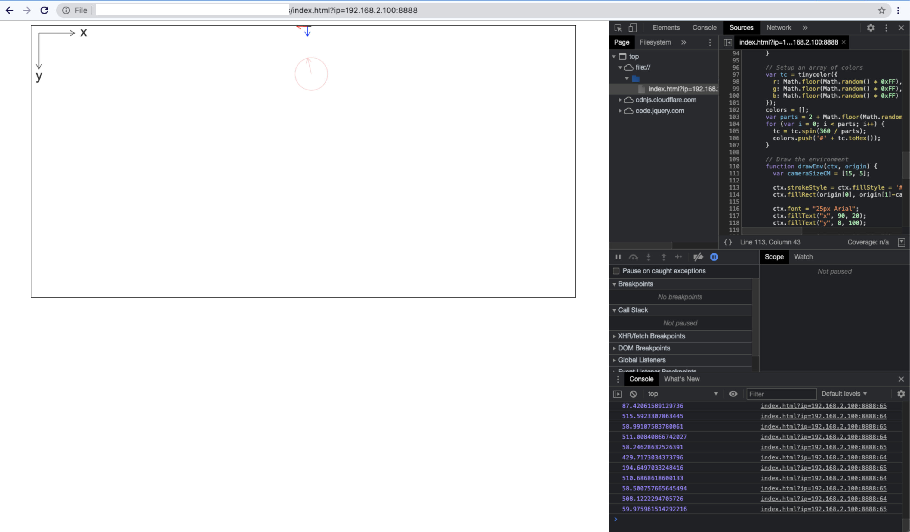

# A Plain HTML/JavaScript/CSS HCI Project Demo

## Running

The following dynamic art display allows users to draw on a shared canvas and build upon previous user drawings. The system tracks the user’s body and parses the direction and speed of the movements to create paint strokes on the canvas. The user's interaction time is controlled with a 30 second countdown timer. When the time is up, the system displays a QR code which links to an external website, where the user can download their artwork, view other people’s artworks, and sign up for a mailing list to receive the completed form of their artwork.

Tasks addressed:
1. The installation uses the user's body as a paintbrush. The display parses user movements to determine the color of the paintstroke, depending on different body parts and speeds.
2. The installation allows users to take their artwork home. The QR code allows the user to download their work in the form of a digital file.

Open `index.html` in a Chrome web browser window.

Add the following string to the end of the URL to connect to the server: `?ip=[Development_IP]:8888` where `[Development_IP]` is provided in the [Project 2 Tutorial](https://cpsc484-584-hci.gitlab.io/s21/project2_tutorial/#current-server-ips)

The demo will look like this once it's loaded:

